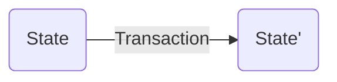
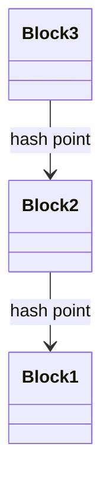
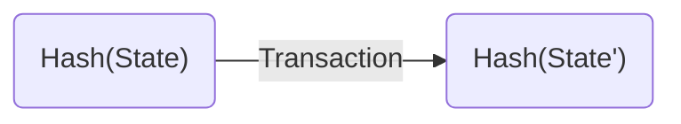

简单来说，以太坊是一个图灵机。他有一个状态(state)，这个状态包含所有的钱包状态和智能合约以及其状态。状态类似于图灵机的无穷纸带，无穷纸带上也是同时存储着数据和程序。人们通过交易(transaction)向他发送指令，他根据指令进行操作或者运行智能合约，得到一个新的状态(state')。

让这个图灵机与众不同的地方在于没人能篡改他的状态，并且没人能阻止他的运行。这些优势来源于他的底层数据结构：区块链。

### 区块链

区块链是一种数据结构，类似于链表。链表是一个经典数据结构，每一个项都有一个指向前继(或者后继)的指针。区块链在链表的基础上做了一个改动，把链表指向前继指针换为前一个区块的哈希。每一个新的区块都包含前面区块的哈希值，一直传递到第一个区块。中间任何区块的数据修改都会让该区块后的所有区块哈希产生变化。这就让区块链具备了感知篡改的能力。

到这里，区块链是一个能够感知篡改的，只能追加数据的存储结构，还无法胜任以太坊的需求。需要注入一些灵魂让区块链活起来。

### 加密货币

区块链是一个静态的数据结构，只有活着的区块链才有防篡改，去中心化等等特性。其中的关键因素就是加密货币。

首先，每一个新的区块都会产生一些加密货币。按规则创建区块的人有权利添加一条交易把这些加密货币添加到自己的钱包状态中去。这导致人们热衷于创建新的区块。为了避免无成本的随意创建区块，人们需要证明自己投入了相当多的资源来获得创建区块的权力。这个资源就是算力和电费。这些花费唯一的意义就是证明自己投入了这些资源。偶尔多个竞争者会同时获得记账权，这时解决争端的方式是以最长的链为正确的链。

在大家争相创建区块的时候，去中心化就产生了。创建区块的权力根据算力的大小随机的分发给竞争者。大家踊跃验证别人创建区块的正确性。然后马上投入下一个区块的算力竞争。任何篡改之后的区块链都无法被其他人认可，并且由于算力的累积也无法追赶上最长链。

记账人不仅仅需要承担工作量证明的算力，还需要把用户的交易(trancation)收集起来，并且从上一个区块的状态(State)通过执行这些交易(transaction)获得新的状态(State')。这时，另一个问题出现了，就是如何让创建区块的人把用户发送的交易加入区块中。这里加密货币也起到了关键作用：创建区块的人除了能获得区块新增的加密货币外，还能从每个用户交易当中获取小费，这样记账的人就倾向于把小费更多的交易纳入区块中。

小费还解决了图灵机的停机问题，在普通的图灵机中，我们没办法判定一个程序是否会停机，在以太坊中，任何一个操作都需要一定量的小费，当智能合约长时间运行的时候小费会被耗尽，这就是停机的时候。

区块链和加密货币提供了一个竞争的记账人构成的去中心化的状态转移机器（类似图灵机中的读写头）但是区块链提供的存储系统却是不可篡改只能追加的。和以太坊所需要的状态模型不太匹配。状态的模型需要能够修改以前的数据，比如一个智能合约中参数的值，或者一个钱包中的余额。

### 状态树

在以太坊中，用户钱包和智能合约，都有一个40个16进制数长度的地址。用户的地址里存着他的余额和用户状态；智能合约的地址里存着代码和智能合约的参数值。

为了实现地址到状态的存储和更改，以太坊使用了一种数据结构，叫默克尔路径压缩的字典树(MPT)。为了简化我们可以想象他就是可以字典树。地址是他的Key，而叶子节点中的内容就是地址对应的状态。这样的存储结构能够方便的进行修改。在这里用同样的把戏，把树的指针改为哈希指针之后，我们就能方便的算出整个状态的哈希值。这样我们只需把所有状态的哈希存在区块链中。而巨大的状态内容可以使用别的存储和同步方式，并且用链上的哈希去验证。所以矿工记账的过程可以看作是从老的状态的哈希算出新的状态的哈希。

### 最后

以太坊在区块链上实现了一个去中心化的不可篡改的图灵机。他把记账人当作图灵机的读写头，把状态树当作图灵机中无穷长的纸带，通过MPT把状态压缩成一个hash值，有种一叶一世界的感觉，应该是一区块一世界。